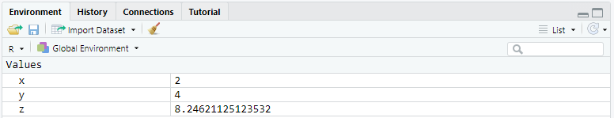
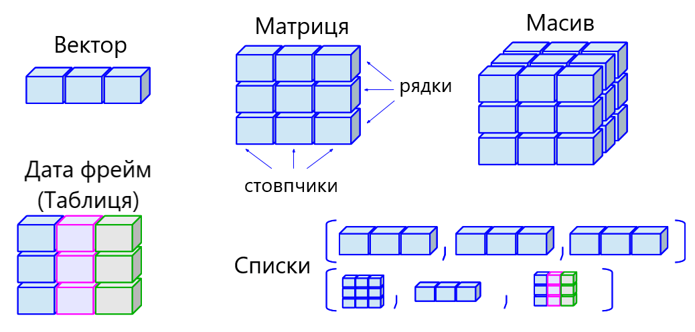

# Вступ до R {#introR}
***
```{r echo = FALSE, purl = FALSE, cache = FALSE, include=FALSE}
knitr::opts_knit$set(global.par = TRUE)
knitr::opts_chunk$set(warning = FALSE, message = FALSE, collapse = TRUE, out.width = '100%', fig.align='center', out.width = "100%")
```

Мова програмування **R** --- потужний інструмент, що широко використовується в різних сферах: статистика, візуалізація, наука про дані, машинне навчання, глибоке навчання тощо. Це безкоштовна система з відкритим кодом, з широкими можливостями, які досягаються за рахунок різноманіття пакетів (*packages*) доповнень.
**R** повністю безкоштовний та доступний для встановлення на більшість операційних систем. Крім того, є можливість працювати у хмарних додатках.
В той же час, **R** ідеально підходить для проведення економетричних досліджень.
Вивчити **R** не складно і цей розділ підготовить Вас до базових операцій.

## Встановлення R
***
Варіантів роботи з мовою програмування **R** існує досить багато. Розберемо основні.

### Встановлення на комп'ютер.
Для початку необхідно встановити саму мову програмування під свою операційну систему:

- [Windows](https://cran.r-project.org/bin/windows/base/)
- [MacOS](https://cran.r-project.org/bin/macosx/)
- [Linux](https://cran.rstudio.com/bin/linux/)

Для роботи в **R**, також слід встановити інтегроване середовище розробки (IDE) **RStudio**, що значно підвищує зручність, швидкість та ефективність роботи.

Щоб встановити **RStudio**, завантажте останню версію інсталятора для Вашої операційної системи з сайту [https://rstudio.com/products/rstudio/download/](https://rstudio.com/products/rstudio/download/)

### Використання хмарних сервісів
У випадках, коли не має можливості або бажання щось додатково встановлювати на ПК є декілька хмарних сервісів:

- [RStudio Cloud](https://rstudio.cloud/)
- [Google Colab](https://colab.research.google.com/#create=true&language=r)

## RStudio
***
Я пропоную використовувати саме **RStudio**, оскільки це найзручніший інструмент для роботи з даними.
При чому в ній можна працювати з різними мовами програмування, в тому числі й **Python**.

Якщо ваша операційна система --- Windows, то після встановлення R та RStudio, на робочому столі у вас буде дві іконки:

<div style="text-align:center"> та </div>

Перша відноситься до самої мови програмування і не буде використовуватись в роботі, друга відноситься до RStudio і саме вона нам потрібна.

Після першого запуску RStudio ви побачите інтерфейс на рисунку \@ref(fig:rstudio1)
```{r rstudio1, out.width = "100%", fig.align='center', echo = FALSE, fig.cap = "Базовий інтерфейс RStudio"}
knitr::include_graphics("docs/images/rstudio_01.png")
```

Як правило код пишуть у скрипті (такий собі аналог текстового редактора), тож для його створення необхідно натиснути зелений хрестик в лівому верхньому куті та обрати пункт **R Script** або натиснути комбінацію клавіш **Ctrl+Shift+N**:

```{r rstudio2, out.width = "75%", fig.align='center', echo = FALSE, fig.cap = "Створення скрипта в RStudio"}
knitr::include_graphics("docs/images/rstudio_02.png")
```

Після чого, з’явиться додаткове вікно скрипту, де можна писати код, зберігати його та повертатися до нього за потреби.

Давайте розберемо отриманий інтерфейс:
```{r rstudio3, out.width = "100%", fig.align='center', echo = FALSE, fig.cap = "Інтерфейс RStudio"}
knitr::include_graphics("docs/images/rstudio_03.png")
```

**1. СКРИПТ** --- відбувається основна робота з кодом.

**2. КОНСОЛЬ** --- повертаються результати виконання скриптів. Хоча тут так само писати код, проте він не буде збережений.

**3. РОБОЧИЙ ПРОСТІР** --- тут зберігаються змінні, завантажені датасети та побудовані моделі. Крім того є окреме вкладинка історії останніх команд.

**4. ГРАФІКИ та ФАЙЛИ** --- тут в окремих закладинках відображаються графіки, є невеличкий файловий менеджер, менеджер пакетів (про них трошки пізніше) та довідка по функціям (сюди будемо звертатися досить часто).

## Базові операції
***
R - мова програмування з широкими можливостями. З її допомогою можна будувати математичні моделі, проводити статистичні тести, візуалізовувати дані тощо. Але почнемо з чогось максимально простого, наприклад, арифметики.

### R та арифметика
Вже з "коробки", без додаткових пакетів, R надає можливість проводити арифметичні розрахунки. Всі ці операції виконуються за допомогою типових операторів, до яких ми звикли ще з часів навчання в школі або викорситання Excel.

Так, додавання додавання двох чисел використовується оператор `+`:
```{r}
2 + 2
```

Для віднімання --- оператор `-`:
```{r}
5 - 2
```

Множення через оператор `*`:
```{r}
3 * 5
```

Ділення --- `/`:
```{r}
25 / 5
```

Піднесення до степеню через `^`:
```{r}
3 ^ 3 
```

Як бачимо, нічого складного. Давайте розглянемо, ще два оператори.

Залишок від ділення --- `%%`:
```{r}
5 %% 3
```

Цілочисельне ділення --- `%/%`:
```{r, collapse=TRUE}
17 %/% 5
```

Узагальнений перелік арифметичних операторів я помістив у наступну таблицю.

| Оператор | Опис                 | Пиклад  |
|:--------:|----------------------|---------|
|     +    | Додавання            | a + b   |
|     -    | Віднімання           | a - b   |
|     *    | Множення             | a * b   |
|     /    | Ділення              | a / b   |
|     ^    | Степінь              | a ^ b   |
|    %%    | Залишок від ділення  | a %% b  |
|    %/%   | Цілочисельне ділення | a %/% b |

### Коментарі до коду
Важливою складовою написання коду, окрім його зрозумілості та лаконічності, є коментарі, які допомагають оріентуватися, що відбувається в даному шматку коду.

Для додавання коментарів використовується знак ришітки або, як його ще називають, діез --- `#`. Все, що написано у рядку після `#` ігнорується R:
```{r}
# look at this awesome code
2 + 2 - 3 + 1
```

Якщо необхідно "закоментувати" частину коду, тобто поставити `#` на початку кожного рядка, то для цього є комбінація клавіш **Ctrl + Shift + C**.

### Пріоритети розрахунків
Після знайомства з арифметикою в R постає логічне питання з приводу пріоритетів операторів. На справді тут все просто, пріоритети працюють як в математиці. Тож не забувайте правильно розставляти дужки.

```{r}
2 + 3 * 4

(2 + 3) * 4
```

### Готові функції
Крім звичайних арифметичних операторів в мові програмування R одразу вбудовано багато різноманітних функцій, в тому числі й математичних.

Для розрахунку кореня квадратного з числа використовується функція `sqrt()`, яка може бути вам знайома, якщо ви користувалися англомовною версією Excel.
```{r}
9^0.5

9^(1/2)

sqrt(9)
```

> ***Мова програмування R чутлива до регістру***, тож варіанти Sqrt(9), SQRT(9) працювати не будуть.

Разом з тим, в середині функції можна проводити математичні розрахунки:
```{r}
sqrt((2 + 3) * 4)
```

Функція `abs()` розраховує абсолютне значення:
```{r}
abs(3 - 5)
```

Розрахунок натурального логарифму через функцію `log()`:
```{r}
log(15)
```

Але це ще не все, оскільки для логарифму притаманно мати основу, то в таких випадках слід додати в середині дужок додатковий аргумент `base = `:
```{r}
log(x = 10, base = 3)
```

Аргументи функцій можна змінювати місцями:
```{r}
log(base = 3, x = 10)
```

Доречі не обов'язково писати назви аргументів функцій. Якщо ви впевнені в їх порядку запис може виглядати наступним чином:
```{r}
log(10, 3)
```

Взагалі використання функцій --- важлива особливість мови програмування R. Ми можемо створювати власні функції, використовувати функції як аргументи інших функцій тощо.

### Вбудована документація
Вже на цьому етапі може виникнути ряд питань:

- де знайти опис функції?
- які існують аргументи функцій?
- чи є якісь приклади використання функцій?

Відповідь досить проста --- всі функції супроводжуються детальною документацією. Для її виклику можна скористуватися функцією `help()`, де в середині дужок вказати назву функції:
```{r eval=FALSE}
help(abs)
```

Інший варіант --- це написати в консолі знак питання і після цього назву функції:
```{r eval=FALSE}
?abs()
```

Але на мою думку, **найшвидший варіант** --- це написати функцію і **натиснути клавішу F1** на клавіатурі. 

Всі зазначені варіанти приведуть вас до вікна документації у правому нижньому куті RStudio:

<div style="text-align:center"></div>

### Створення змінних
Ще один важливий пункт у багатьох мовах програмування --- можливість зберігати значення у змінних.

В R це робиться за допомогою символів **<-**. Для швидкого написання існує зручна комбінація клавіш `Alt + -`.

Ліворуч від символу **<-** записується назва майбутньої змінної. Праворуч --- значення або вираз, яке необхідно зберегти в цю змінну.

```{r}
x <- 2
y <- 4
z <- sqrt(x^2 + y^3)
```

> Для присоювання можна використовувати і знак **=** але серед спільноти користувачів R це не прийнято.

Слід звернути увагу, що при присвоюванні результат розрахунку не виводиться в консоль. Якщо ж хочеться переглянути результат слід використати функцію `print()` або просто звернутися до створеної змінної:
```{r}
print(z)

z
```

Після створення змінна з'являється у вкладинці **Environment** робочого простору RStudio:
<div style="text-align:center"></div>


### Оператори порівняння
В процесі роботи з даними, досить часто працюємо з задачами порівняння. Для вирішення таких питань в мові програмування R є зручні та зрозумілі оператори:

| Оператор порівняння | Опис                | Приклад |
|:-------------------:|---------------------|---------|
|          ==         | Дорівнює            | a == b  |
|          !=         | Не дорівнює         | a != b  |
|          >          | Більше              | a > b   |
|          <          | Менше               | a < b   |
|          >=         | Більше або дорівнює | a >= b  |
|          <=         | Менше або дорівнює  | a <= b  |

> Окремо зауважу, що для порівняння двох змінних використовується оператор з подвійним знаком дорівнює `==`, а не з одним `=`. Це досить популярна помилка.

## Типи даних
***
Інформація зберігається в різних типах даних. Це може бути число, текст, булева змінна тощо.

1. Один з найпопулярніших варіантів збереження даних --- це **числовий формат**. В мові програмування R для нього є окремий клас --- **numeric**. При цьому існує три типи numeric:

- Цілі - **integer**.
- Дробові - **double**.
- Комплексні - **complex**.

В більшості випадків R буде сам конвертувати числа в потрібний формат. Але якщо необхідно задати конкретний тип числа, то можна використати функції `as.integer()`, `as.double()` та `as.complex()`.

> В мові програмування R досить багато функцій, які починаються на `as.`, які переводять об'єкт до конкретного класу. Іншими словами просить читати дані в середені дужок у відповідному форматі.

Для створення цілочислового значення можна в кінці поставити символ `L`, щоб примусово оголосити число як integer:
```{r}
is.integer(10)

is.integer(10L)
```

> Функції, що починаються на `is.` перевіряють, чи належить об'єкт до обраного класу.

2. Для роботи з **текстовими даними** є клас **character**. Вони записуються в лапках, при цьому можна використовувати як подвійні `"` так і одинарні `'`.
```{r}
is.character("Ash nazg durbatulûk, ash nazg gimbatul,
             ash nazg thrakatulûk, agh burzum-ishi krimpatul.")
```

3. **Логічні (logical) данні** - це тип даних які приймають лише значення `TRUE` або `FALSE`. Ми з ними вже зустрічалися коли використовували оператори порівняння.

Для перевірки типу даних використовується функція `class()`:
```{r}
class(5)
```

## Структури даних
R працює з багатьма структурами даних: вектори, матриці, масиви, дата фрейми та списки. Вони відрізняються за способом створення, структурою, складністю будови та способом звернення до їх елементів. Схематично ці структури даних зображено на рисунку \@ref(fig:datastr)
```{r datastr, out.width = "100%", fig.align='center', echo = FALSE, fig.cap = "Структури даних R"}

```

### Вектор
Почнемо з найпростішого. **Вектор** - це одновимірна послідовність елементів **одного типу**. Для створення вектору використовується функція `c()`.
```{r}
c(2, 4, 8, -2, -6, 0)

c("два", "чотири", "шість")

c(TRUE, TRUE, FALSE)
```

Для створення послідовностей з кроком 1 зручно використовувати оператор `:`
```{r}
-5:5

3:-2
```

Для більш складних послідовностей є вбудована функція `seq()` (не забувайте дивитися довідку по функціям)
```{r}
seq(1, 10, by = 2)
```

Крім того можна задати не лише крок послідовності (аргумент `by =`), а й довжину (аргумент `length.out =`)
```{r}
seq(1, 10, length.out = 3)
```

Інша корисна функція `rep()` дозволяє створити вектор з повторюваними значеннями. Перший аргумент - значення яке слід повторювати, другий аргумент - скільки разів повторювати.
```{r}
rep(3, 5)
```

При цьому і перший і другий аргумент може бути вектором:
```{r}
rep(1:3, 5)

rep(1:3, 1:3)
```

Крім того можна об'єднувати вектори:
```{r}
v1 <- c("Say", "friend")

v2 <- c("and", "enter")

c(v1, v2)
```

В означенні вектора в мові програмування R сказано, що **всі елементи вектори мають бути одного типу**. Одразу хочеться перевірити, що буде, якщо ця умова не буде виконуватись. В більшості мов програмування ми б отримали помилку. Мова програмування R, при неспівпадінні типів, буде зводити все до "спільного знаменника", тобто конвертувати дані за певними правилами - приведення типів (coercion).

Видиділють два типи:

- **неявне приведення типів (implicit coercion)**, коли все відбувається автоматично за вбудованими правилами.
- **явне приведення типів (explicit coercion)**, коли ми самі вирішуємо до якого типу перевести дані, якщо це можливо.

Приклад неявного приведення типів:
```{r}
c(TRUE, 2, FALSE)

3 - TRUE
```
`TRUE` перетворився в `1`, а `FALSE` в `0`.
В даному випадку всі дані приведено до текстовиого типу:
```{r}
c(TRUE, 2, "Hello")
```
В R є своя іерархія типів:
`NULL < raw < logical < integer < double < complex < character < list < expression`

Для явного приведення типів даних використовуєтсья сімейство функцій, що починається на `as.`:
```{r}
as.numeric(c(TRUE, 2, FALSE, FALSE))

as.character(c(TRUE, 2, FALSE, FALSE))
```

#### Операції з векторами
Всі арифметичні операції, що ми розглядали раніше, можна використовувати і **до векторів однакової довжини**:
```{r}
q <- 1:5

w <- 2:6

q + w

q - w

q * w

q / w

w ^ q + q - w * q

sqrt(q)
```

#### Правило переписування
Якщо **вектори не однакової довжини** і ми хочемо провести з ними певні операції, то в такому випадку спрацює **правило переписування (recycling rule)**: якщо коротший вектор кратний довжині довшого, короткий буде повторюватися необхідну кількість разів.
```{r}
q <- 1:2
w <- 1:4
q * w
```

Операції з вектором та окремим значенням можна вважати окремим випадком ресайклінга: окреме значення буде повторюватися необхідну кількість разів:
```{r}
w * 2
```

Якщо коротший вектор не кратний довшому (наприклад, перший довжиною 2, а інший  - 3), то R все одно порахує результат, але видасть попередження:
```{r warning = TRUE}
q + c(1, 5, 7)
```

#### Індексація векторів
Індексація - задача вибору окремого елемента структури даних. Для цього використовуються квадратні дужки `[]`.

Найпростіший варіант індексація по номеру, тобто порядкове значення елемента:
```{r}
e <- c(-5:-3, 2, 7, -6, 4:2)
e[1]

e[5]
```

>**Важливий факт - індексація в мові програмування R починається з 1.**

За допомогою індексації можна не лише звертатися до окремого елементу, а й заміняти його значення:
```{r}
e[5] <- 15
```

Можна використовувати цілі вектори для індексації:
```{r}
e[2:5]

e[6:1]
```

Індексація зі знаком мінус видасть всі значення вектора крім обраних:
```{r}
e[-1]

e[c(-1, -5)]
```

### Матриці
**Матриця (matrix)** --- це двовимірний масив даних, в якому кожен елемент має однаковий тип (числовий, текстовий, логічний). Іншими словами, матриця - це двовимірний вектор, у якого є довжина та ширина.

Створення матриці відбувається за допомогою функції `matrix()`, в якій слід вказати кількість рядків та ствопчиків:

```{r}
matrix(1:16, nrow = 4, ncol = 4)
```

За замовчуванням значення матриці заповнюються по стовпчикам. Але це можна змітини за допомогою арументу `byrow = TRUE`
```{r}
matrix(1:16, nrow = 4, ncol = 4, byrow = TRUE)
```

Оскільки матриця --- це двовимірний масив, то для індексації використовуються два індекси, що розділені комою: перший відповідає за рядок, другий за стовпчик.
```{r}
my_matrix <- matrix(1:16, nrow = 4, ncol = 4)
my_matrix

my_matrix[2, 3]

my_matrix[1:2, 3:4]
```

Якщо один з індексів залишити пустим --- отримаємо всі значення рядка/стовпчика в залежності від того, який індекс ми не вказуємо.
```{r}
my_matrix[, 1:2]

my_matrix[1:2, ]
```

Аналогічно до вектора, за допомогою індексації можна переписувати частину матриці:
```{r}
my_matrix[1:2, 3:4] <- 0
my_matrix
```

### Масиви
**Масиви даних (array)** --- схожі на матриці, але мають більше двох вимирів. Створюються вони за допомогою функції `array()`, де слід вказати вектор, з якого буде створено масив, і його розмірність:
```{r}
my_array <- array(1:16, c(4, 2, 2))
my_array
```

### Списки
**Списки** --- це впорядкований набір об'єктів. Я представляю собі списки, як блокнот, в якому на кожній сторінці зберігається інформація у певному форматі. Вони можуть зберігати різні дані, в тому числі вектори, матриці, дата фрейми й інші списки.

Списки створюються за допомогою функції `list()`:
```{r}
my_list <- list(vec = c(1:5),
                gendalf = "You shall not pass",
                my_matrix = matrix(1:4, ncol = 2))
my_list
```

В даному випадку `vec`, `gendalf` та `my_matrix` --- назви елементів списку.

Для звернення до елементів списку можна використовувати індекси або імена (через символ `$`). При зверненні через індекс необхідно використовувати подвійні квадратні дужки, наприклад:
```{r}
my_list[[2]]

my_list$gendalf

my_list[['gendalf']]
```
Списки досить часто використовуються в R, наприклад результати побудови математичних моделей, статистичних тестів зберігаються у вигляді списків. тож важливо вміти з ними працювати.

### Дата фрейми
Нарешті ми перейшли до найголовнішого - **дата фрейми (data frames)**. Саме з такою структурою даних працюють найчастіше. Головною особливістю їх є те, що різні стовпчики можуть містити різний тип даних (але їх довжина має бути однаковою).
Для створення дата фрейму використовується функція `data.frame()`.
```{r eval=FALSE}
my_df <- data.frame(name = c("Frodo", "Eowyn", "Legolas", "Galadriel"),
                    sex = c("male", "female", "male", "female"),
                    age = c(51, 24, 2931, 2700),
                    one_ring = c(TRUE, FALSE, FALSE, FALSE))
my_df
```

```{r echo=FALSE}
my_df <- data.frame(name = c("Frodo", "Eowyn", "Legolas", "Galadriel"),
                    sex = c("male", "female", "male", "female"),
                    age = c(51, 24, 2931, 2700),
                    one_ring = c(TRUE, FALSE, FALSE, FALSE))
knitr::kable(my_df)
```


```{r}
```

Переглянути структуру дата фрейму можна за допомогою функції `str()`:
```{r}
str(my_df)
```
В нашому випадку перший та другий стовпчик - *текстові*, третя - *числова*, четверта - *логічна*.

Преглянути назви ствопців або надати їм нову назву можна за допомогою функції `names()`.
```{r}
names(my_df)
```

Індексація аналогічно до матриці та списків можлива через `[]` та знак `$`.
```{r}
my_df$name

my_df$name[2:3]

my_df[2,3]

my_df[2:3, "name"]
```

Для перегляду дата фрейму в RStudio використовується функція `View()` або можна просто натиснути на назву змінної у розділі Environment. Ви побачите таблицю, дещо схожу на Excel або Google Spreadsheets.


## Пакети в R
***

## Імпорт та експорт даних
***

## Умовні конструкції
***

## Створення функцій в R
***

## Вступ у Tidyverse
***

## Створення звітів: R Markdown
***
